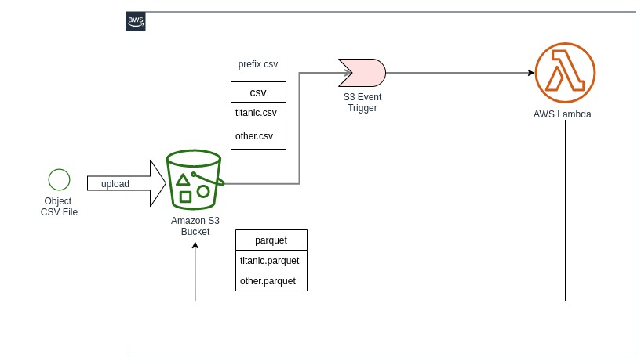
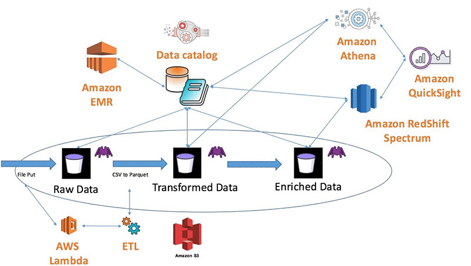

# AWS S3 & Lambda CSV to Parquet using Golang and Spark Scala

This repository contains sample of converting a CSV file which is uploaded into AWS S3 bucket to Parquet format.

The upload of a CSV file into S3 bucket will trigger a lambda function to convert this object into parquet and then write the result to another prefix in the bucket as shown in the image below.

We have implemented this feature using two different programming language.

## Golang

For the golang you have to:

1. build the binary for your module
    `GOARCH=amd64 GOOS=linux go build -gcflags='-N -l' -o . .`

2. Package the binary:
    `zip function.zip binaryFile`

3. Also sometinmes you'll need to set the executable bit in the zipfile. There are a bunch of ways to do this, if you want to do it on windows, you'll need to run a [python script](https://stackoverflow.com/questions/57964626/permissions-denied-when-trying-to-invoke-go-aws-lambda-function) which i find it in the stackoverflow.

## Spark Scala

For spark scala:

1. package a JAR/ZIP file using sbt or maven including the dependencies

2. Pass this Jar file to the lambda function

# AWS 

1. Create A Role that allow lambda to interact with S3 bucket and Log to CloudWatch

2. Create Lambda function

3. Create Bucket and the two folder (prefix) for csv files and parquet files

4. Create Event from s3 properties window to trigger lambda function on upload 

## Optimization (Thinking!!!!)

- We can improve this project with others feature:
  - Adding a pipeline to deploy version of lambda automatically after commit using travisCI or gitlabCI
  - What if a lambda function fails? there is a default 3 times retry configured in AWS and We can put file not processed in others prefix to be processed later
  - We can even change the way we process the data and using AWS Glue instead which is an ETL that uses EMR cluster (Hadoop) under the hood to process data.
  
  

  - We can orchestrate the piepline using AWS CodePipeline
  - What if we have too much csv files uploaded in the same time ?
